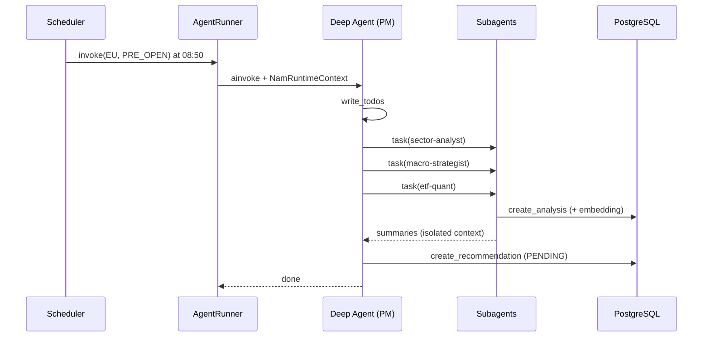
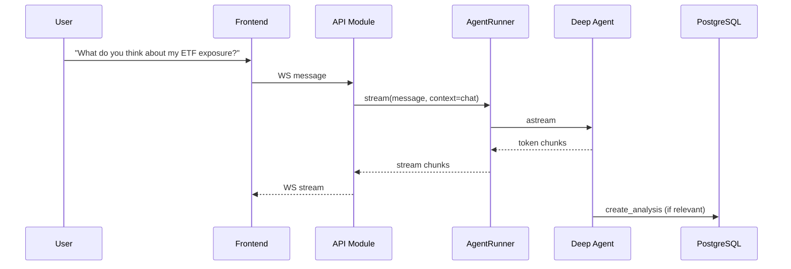
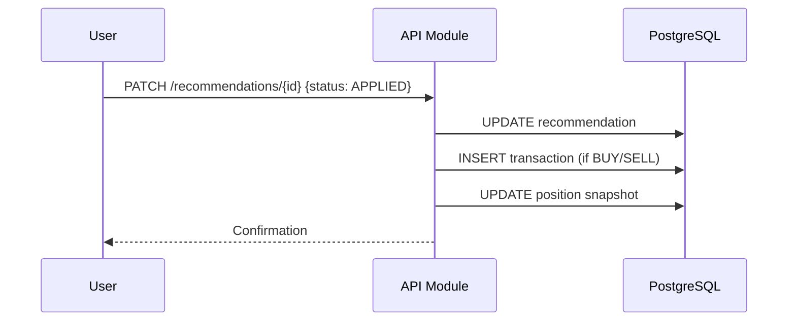
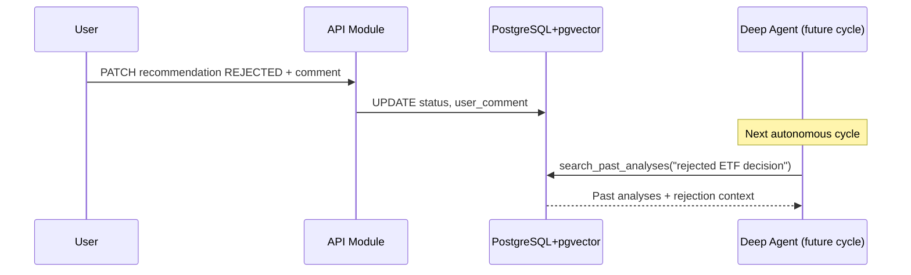

# Nestor Asset Manager (NAM) — OpenSpec

> **Version**: 0.2.1  
> **Status**: Partial implementation — portfolio API + agent runtime + chat stream  
> **Standard**: OpenSpec (Fission-AI) — master reference document  
> **Last updated**: 2026-06-10

---

## Table of contents

1. [Vision and scope](#1-vision-and-scope)
2. [Repository structure](#2-repository-structure)
3. [System architecture](#3-system-architecture)
4. [Database specifications](#4-database-specifications)
5. [API module (FastAPI)](#5-api-module-fastapi)
6. [Agentic module (Deep Agents)](#6-agentic-module-deep-agents)
7. [Autonomous market scheduler](#7-autonomous-market-scheduler)
8. [Agent design system (OOP)](#8-agent-design-system-oop)
9. [Tool catalog](#9-tool-catalog)
10. [Core business flows](#10-core-business-flows)
11. [Non-functional requirements](#11-non-functional-requirements)
12. [Out of scope and future phases](#12-out-of-scope-and-future-phases)
13. [Glossary](#13-glossary)

---

## 1. Vision and scope

### 1.1 Intent

NAM is an **autonomous** financial decision-support team. **Local Deep Agents** ([LangChain Deep Agents](https://docs.langchain.com/oss/python/deepagents/overview) harness on LangGraph, inference via Ollama or vLLM) continuously observe markets and the portfolio, produce **textual analyses**, and **rebalancing recommendations**.

The agent runs **autonomously** on a market schedule (EU, US, Asia). **Chat is optional** — a WebSocket channel to talk to the same agent when the user wants to.

The user retains **final control**: every recommendation stays in `Pending` status until explicitly validated (`Applied` or `Rejected`) via the API.

### 1.2 Objectives

| ID | Objective | Success criterion |
|----|-----------|-------------------|
| O1 | Assisted decisions, never automated execution | No buy/sell order without user action via the API |
| O2 | Modularity and scalability | API and Agentic deployable independently, coupled via PostgreSQL |
| O3 | Long-term semantic memory | pgvector search over analysis history and user feedback |
| O4 | Financial traceability | Immutable ledger (Transaction) + position snapshot (Position) |
| O5 | Runtime personalization | User context (strategy, goals) injected into agent runtime |
| O6 | Autonomous market observation | Agent runs scheduled briefs/checks without user interaction |
| O7 | Clean, modular codebase | OOP-first design — classes, not dict configs |

### 1.3 Scope (included)

- **Monorepo** with shared `packages/db` (SQLAlchemy models + Alembic)
- **API module** — async FastAPI: financial CRUD, first-run user setup, WebSocket chat, recommendation management
- **Agentic module** — always-on FastAPI service (`nam-agentic`): Deep Agents harness, event bus, APScheduler market jobs in app lifespan
- **PostgreSQL + pgvector**: structured data + embeddings
- **Frontend** (API consumer): functional scope defined, implementation deferred
- Pydantic v2 schemas for all Tool and API interfaces
- OOP architecture throughout the Python codebase

### 1.4 Non-goals (excluded from v1)

- Order execution on real brokers (IBKR, Binance, etc.)
- Direct agent writes to `Transaction` or `Position`
- Enterprise OAuth / SSO
- Authentication / login (local single-user side project — see §1.6)
- Multi-tenant / concurrent multi-user (one human user per deployment in v1)
- Automated quantitative backtesting
- Managed cloud deployment (local/on-prem infra in v1)
- Hand-built LangGraph routing graphs (use Deep Agents harness instead)

### 1.5 Actors

| Actor | Role |
|-------|------|
| **User (human PM)** | Validates or rejects recommendations, records transactions, optionally chats with the agent — **the only user** in a v1 deployment |
| **Portfolio Manager (Deep Agent)** | Main agent — orchestrates subagents via `task()`, creates recommendations |
| **Sector Analyst (subagent)** | Analyzes individual equities |
| **Macro Strategist (subagent)** | Analyzes macroeconomic and geopolitical context |
| **ETF & Quant Specialist (subagent)** | Analyzes indices and passive instruments |
| **Market Scheduler (agent runtime)** | APScheduler inside `nam-agentic` FastAPI — triggers Deep Agent at market session times |
| **API Module** | HTTP/WS entry point, persistence (no auth in v1) |
| **PostgreSQL** | Data bus, structured and vector memory |

### 1.6 Deployment model (v1)

NAM is a **local / self-hosted side project**: one person runs API + agent + Postgres on their machine (or a single VM). There is **no authentication layer**.

- **One user max** per database — the `users` table holds a single profile row after first-run setup.
- **First-run setup** initializes profile fields (`firstname`, `date_of_birth`, `strategy`, `goals`). Portfolio and agent runtime read that row via `DEFAULT_USER_ID` (env) or equivalent singleton lookup.
- **No login, no JWT, no multi-tenant isolation** — trust boundary is physical access to the host.
- Routes may still expose `user_id` for REST clarity during v1; the value is always the configured singleton user. A future refactor may drop `user_id` from URLs once setup is stable.

**Non-goal:** fastapi-users, register/login, or per-request auth middleware in v1.

### 1.7 Code conventions

| Rule | Detail |
|------|--------|
| **Language** | All code identifiers in English (columns, classes, modules, routes, tools) |
| **Specs language** | English |
| **Conversation** | French (team communication) |
| **Paradigm** | OOP-first — agents, tools, and schedulers are **classes**; system prompts are **markdown files** |
| **No dict configs** | Subagent specs MUST use `SubAgent(...)` (Deep Agents `TypedDict`), built via class `to_spec()` — not untyped dict literals |
| **Enums everywhere** | Domain values MUST use Python `Enum` classes from `nam_db.enums` — never `Literal[...]` string unions |
| **DB/Python parity** | Every PostgreSQL enum MUST have a matching Python enum with identical member values |
| **Separation** | SQLAlchemy models ≠ Pydantic schemas; ORM in `packages/db`, HTTP schemas in `api/`, Tool schemas in `agentic/` |

---

## 2. Repository structure

### 2.1 Monorepo layout

```text
nam/
├── pyproject.toml                 # uv/poetry workspace root
├── openspec.md
├── openspec/
│
├── packages/
│   └── db/                        # Shared package: nam-db
│       ├── pyproject.toml
│       ├── alembic/
│       │   ├── env.py
│       │   └── versions/
│       └── nam_db/
│           ├── base.py            # DeclarativeBase
│           ├── session.py         # async engine + session factory
│           ├── enums.py
│           └── models/
│               ├── user.py
│               ├── index.py
│               ├── transaction.py
│               ├── position.py
│               ├── analysis.py
│               └── recommendation.py
│
├── api/
│   ├── pyproject.toml             # depends: nam-db only (HTTP to agentic)
│   └── nam_api/
│       ├── main.py
│       ├── routers/
│       ├── services/              # business logic + agentic_client (HTTP events)
│       ├── schemas/               # Pydantic HTTP request/response
│       └── websocket/             # WS /ws/chat → agentic POST /chat/stream
│
└── agentic/
    ├── pyproject.toml             # depends: nam-db
    └── nam_agentic/
        ├── main.py                # FastAPI app — lifespan starts APScheduler
        ├── routers/
        │   ├── health.py
        │   └── events.py          # POST /events — event bus entry point
        ├── schemas/
        │   └── events.py
        ├── services/
        │   └── event_handler.py   # routes events → AgentRunner
        ├── factory.py             # DeepAgentFactory — builds the compiled graph
        ├── runner.py              # AgentRunner — invoke/stream wrapper
        ├── agents/                # OOP agent definitions
        │   ├── base.py
        │   ├── portfolio_manager.py
        │   ├── sector_analyst.py
        │   ├── macro_strategist.py
        │   └── etf_quant.py
        ├── prompts/               # Markdown system prompts (one .md per agent)
        │   ├── loader.py          # PromptLoader — reads {NAME}.md
        │   ├── PORTFOLIO.md
        │   ├── SECTOR_ANALYST.md
        │   ├── MACRO_STRATEGIST.md
        │   └── ETF_QUANT.md
        ├── tools/                 # Tool classes (one file per tool)
        │   ├── base.py
        │   ├── portfolio/
        │   └── market/
        ├── scheduler/
        │   ├── markets.py         # MarketSession definitions (EU/US/ASIA)
        │   └── scheduler.py       # register_market_jobs → internal events
        ├── context.py             # NamRuntimeContext dataclass
        └── enums.py               # Market, MarketPhase (runtime-only)
```

### 2.2 Package dependencies

```text
packages/db  ◄───  api
     ▲
     └──────────  agentic

api ──HTTP POST /events──► agentic   (no Python import edge)
```

| Package | Depends on | Provides |
|---------|------------|----------|
| `nam-db` | — | SQLAlchemy models, Alembic migrations, async session |
| `nam-agentic` | `nam-db` | Agent runtime FastAPI, Deep Agent factory, tools, APScheduler |
| `nam-api` | `nam-db` | User REST, business services, HTTP notifications to agentic |

### 2.3 Shared database rules

- **One Alembic history** in `packages/db/alembic/` — run migrations once before starting any process
- **Alembic async template** — initialized with `alembic init -t async alembic` from `packages/db/`; migrations run via `AsyncEngine`, never sync
- **PostgreSQL enum migrations** — use `alembic-postgresql-enum` so native ENUM types are tracked in autogenerate and revision files
- **Both modules import `nam_db`** — never duplicate models
- **Write boundaries enforced in services/tools**, not in the ORM layer

**Alembic setup** (from `packages/db/`):
```bash
alembic init -t async alembic
```

**Enum migration support** (`packages/db/alembic/env.py`):
```python
from alembic_postgresql_enum import configure
configure()
```

### 2.4 Runtime processes

```bash
# Process 1 — User API (REST; WebSocket chat proxy deferred)
uvicorn nam_api.main:app --port 8000

# Process 2 — Agent runtime (always-on: events + market scheduler)
uvicorn nam_agentic.main:app --port 8001
```

Both processes MUST be running for full behaviour: portfolio CRUD works with API alone; onboarding interpretation, market briefs, and chat require agentic.

---

## 3. System architecture

### 3.1 Overview

```text
                         AUTONOMOUS (primary)
                         ════════════════════
┌──────────────────┐  cron (lifespan)  ┌──────────────────┐
│  nam-agentic     │──────────────────►│   Deep Agent     │
│  FastAPI :8001   │  POST /events     │  PM + subagents  │
│  APScheduler     │◄──────────────────│                  │
└────────┬─────────┘  user/chat events └────────┬─────────┘
         │                                        │
         │                              tools + writes
         │                                        ▼
┌─────────────┐   REST/WS    ┌──────────────────┐     ┌──────────────────┐
│  Frontend   │◄───────────►│   nam-api :8000  │────►│  HTTP /events    │
│             │              │   (FastAPI)      │     │  → agentic       │
└─────────────┘              └────────┬─────────┘     └──────────────────┘
                                      │
                            SQLAlchemy │ async
                                      ▼
                        ┌─────────────────────────────┐
                        │   PostgreSQL + pgvector      │
                        │   Financial │ Analyses │ Vec │
                        └─────────────────────────────┘
                                      ▲
                                      │
                            SQLAlchemy │ async (read + limited write)
                                      │
                              ┌───────┴────────┐
                              │  Agentic tools │
                              └────────────────┘

Agent workspace (USER_GOALS.md, etc.) — volume owned by nam-agentic, not served by API
```

### 3.2 Architectural principles

| Principle | Description | Consequence |
|-----------|-------------|-------------|
| **Autonomous first** | Agent observes markets on schedule without user action | APScheduler runs inside `nam-agentic` FastAPI lifespan — not a separate worker |
| **Shared DB, shared models** | Single PostgreSQL + single `nam-db` package | One Alembic, one source of schema truth |
| **Agent read/write separation** | Agents write only `Analysis` and `Recommendation` | `Transaction`/`Position` reserved for API services |
| **Ledger via API CRUD** | `Transaction` rows are mutable via `TransactionService` (create/update/delete); positions are always recalculated from the full ledger | Agents never write transactions |
| **Human-in-the-loop via API** | `Pending → Applied/Rejected` only through API | Agents always create recommendations as `Pending` |
| **Deep Agents harness** | Use `create_deep_agent` + subagents, not hand-built graphs | PM delegates via built-in `task()` tool |
| **Sibling services** | API and agentic deploy independently | Coupling via PostgreSQL + HTTP event bus (`POST /events`) |
| **Chat is optional** | Same Deep Agent, different trigger | API WebSocket `/ws/chat` proxies to agentic `POST /chat/stream` |
| **OOP modularity** | Agents and tools as classes; prompts as markdown | Testable code, editable prompts without redeploy |

### 3.3 Table access matrix

| Table | API Module | Agentic Module |
|-------|:----------:|:--------------:|
| `users` | R/W | R |
| `indices` | R/W | R |
| `transactions` | R/W (CRUD + position recalc) | **—** |
| `positions` | R/W (snapshot) | R |
| `analyses` | R | R/W |
| `recommendations` | R/W (status, comment) | R/W (create Pending) |

### 3.4 Communication patterns

| Pattern | Trigger | Execution | Use case |
|---------|---------|-------------|----------|
| **Scheduled** | APScheduler in agentic lifespan | Cron → `market.session` event → `EventHandler` → `AgentRunner` | Autonomous market briefs/checks |
| **Profile** | `POST /setup`, `PUT /profile` | API → HTTP `user.profile.*` event → agentic | Onboarding, goals interpretation → workspace files |
| **Chat** | User WebSocket message | API `/ws/chat` → agentic `POST /chat/stream` | Optional conversation |
| **Manual** | `POST /trigger-analysis` (future) | API → HTTP event → agentic | On-demand full analysis |

**Data flow (autonomous cycle)**:
1. APScheduler fires at market time inside `nam-agentic` (e.g. EU pre-open −10 min)
2. Scheduler enqueues `market.session` event; `EventHandler` invokes Deep Agent with `NamRuntimeContext(market=Market.EU, phase=MarketPhase.PRE_OPEN)`
3. PM calls `write_todos`, delegates to subagents via `task()`, synthesizes
4. Subagents call `create_analysis` → PostgreSQL + pgvector
5. PM calls `create_recommendation` → status `Pending`
6. Frontend polls API for new recommendations

**Event bus contract** (`POST /events` on nam-agentic):

| Event type | Payload | Source |
|------------|---------|--------|
| `user.profile.created` | optional fields | nam-api after setup |
| `user.profile.updated` | optional fields | nam-api after profile update |
| `POST /chat/stream` | `thread_id`, `content` | nam-api WebSocket proxy |
| `market.session` | `market`, `phase` | APScheduler |

### 3.5 Technology stack

| Layer | Technology | Target version |
|-------|------------|----------------|
| API | FastAPI | ≥ 0.110 |
| ORM | SQLAlchemy | 2.0 (async) |
| Validation | Pydantic | v2 |
| Migrations | Alembic (async template) + alembic-postgresql-enum | latest |
| Agent harness | `deepagents` (LangChain Deep Agents) | latest stable |
| Runtime | LangGraph (via Deep Agents) | latest stable |
| Scheduler | APScheduler | ≥ 3.10 |
| Local LLM | Ollama / vLLM | configurable |
| Embeddings | local model (e.g. nomic-embed, bge) | 384 or 1024 dims |
| Database | PostgreSQL | ≥ 15 |
| Vector | pgvector | ≥ 0.7 |
| Monorepo | uv workspace (recommended) or poetry | latest |

### 3.6 Memory model — two layers

| Layer | Technology | Purpose |
|-------|------------|---------|
| **Working memory** | Deep Agents virtual filesystem + context compression | Session context, tool output offloading, conversation threads |
| **Domain memory** | PostgreSQL + pgvector | Persistent analyses, recommendations, portfolio, semantic search via `search_past_analyses` |

Do not replace pgvector with LangGraph Store for domain analyses — both coexist.

---

## 4. Database specifications

### 4.1 Entity-relationship diagram

```text
User ─────────────┬──────────── Transaction ──────── Index
  │               │                    │              │
  │               └──────── Position ──┘              │
  │                                                  │
  ├── Analysis (content_embedding: vector) ─────────┘ (optional index_id)
  │
  └── Recommendation ──── recommendation_analyses ──── Analysis
                         (M:N junction)
```

### 4.2 PostgreSQL enums

```sql
CREATE TYPE strategy_enum AS ENUM (
  'CONSERVATIVE',
  'BALANCED',
  'GROWTH',
  'AGGRESSIVE'
);

CREATE TYPE transaction_type_enum AS ENUM ('BUY', 'SELL');

CREATE TYPE agent_enum AS ENUM (
  'PORTFOLIO_MANAGER',
  'SECTOR_ANALYST',
  'MACRO_STRATEGIST',
  'ETF_QUANT_SPECIALIST'
);

CREATE TYPE recommendation_type_enum AS ENUM ('BUY', 'HOLD', 'SELL');

CREATE TYPE recommendation_status_enum AS ENUM (
  'PENDING',
  'APPLIED',
  'REJECTED'
);

CREATE TYPE analysis_trigger_enum AS ENUM (
  'MARKET_SESSION',
  'NEWS_EVENT',
  'MANUAL',
  'TASK'
);
```

### 4.2.1 Shared Python enums (`nam_db/enums.py`)

Every PostgreSQL enum above has a **1:1 Python counterpart** in `packages/db/nam_db/enums.py`.  
This module is the **single source of truth** for domain values across SQLAlchemy models, Pydantic schemas, and tools.

**Rules**:
- Enum member **names** and **values** MUST match PostgreSQL exactly (UPPER_SNAKE_CASE)
- NEVER use `Literal["BUY", "SELL"]` or raw strings for domain values
- API and Agentic packages import enums from `nam_db.enums` — do not redefine them
- SQLAlchemy columns use `SAEnum(EnumClass, name="postgres_enum_name", create_constraint=True, native_enum=True)`
- Alembic autogenerate for enums requires `alembic-postgresql-enum` configured in `env.py`

```python
# packages/db/nam_db/enums.py
from enum import Enum


class Strategy(str, Enum):
    CONSERVATIVE = "CONSERVATIVE"
    BALANCED = "BALANCED"
    GROWTH = "GROWTH"
    AGGRESSIVE = "AGGRESSIVE"


class TransactionType(str, Enum):
    BUY = "BUY"
    SELL = "SELL"


class AgentRole(str, Enum):
    PORTFOLIO_MANAGER = "PORTFOLIO_MANAGER"
    SECTOR_ANALYST = "SECTOR_ANALYST"
    MACRO_STRATEGIST = "MACRO_STRATEGIST"
    ETF_QUANT_SPECIALIST = "ETF_QUANT_SPECIALIST"


class SubAgentRole(str, Enum):
    """Roles allowed to author analyses (subset of AgentRole — excludes PM)."""
    SECTOR_ANALYST = "SECTOR_ANALYST"
    MACRO_STRATEGIST = "MACRO_STRATEGIST"
    ETF_QUANT_SPECIALIST = "ETF_QUANT_SPECIALIST"


class RecommendationType(str, Enum):
    BUY = "BUY"
    HOLD = "HOLD"
    SELL = "SELL"


class RecommendationStatus(str, Enum):
    PENDING = "PENDING"
    APPLIED = "APPLIED"
    REJECTED = "REJECTED"


class AnalysisTrigger(str, Enum):
    MARKET_SESSION = "MARKET_SESSION"
    NEWS_EVENT = "NEWS_EVENT"
    MANUAL = "MANUAL"
    TASK = "TASK"
```

**SQLAlchemy model usage**:

```python
from sqlalchemy import Enum as SAEnum
from nam_db.enums import AgentRole, RecommendationStatus, Strategy


class Analysis(Base):
    agent: Mapped[AgentRole] = mapped_column(
        SAEnum(AgentRole, name="agent_enum", create_constraint=True, native_enum=True),
        nullable=False,
    )
```

### 4.2.2 Alembic async migrations

Alembic MUST be initialized with the **async template** and aligned with the application's async session factory.

**Initialization** (run once from `packages/db/`):
```bash
cd packages/db && alembic init -t async alembic
```

**Requirements**:
- `env.py` uses `async_engine_from_config` and `run_async_migrations()` via `asyncio.run()`
- `DATABASE_URL` uses the `postgresql+asyncpg://` driver — same URL as `nam_db/session.py`
- Do NOT use the default sync Alembic template

**Dependencies** (`packages/db/pyproject.toml`):
- `alembic`
- `alembic-postgresql-enum`
- `asyncpg`

**`env.py` enum hook**:
```python
from alembic_postgresql_enum import configure

configure()  # enables PostgreSQL ENUM autogenerate support
```

**Commands**:
```bash
# from packages/db/
uv run alembic revision --autogenerate -m "description"
uv run alembic upgrade head
uv run alembic current
```

**Enum mapping table**:

| PostgreSQL enum | Python enum | Used in |
|-----------------|-------------|---------|
| `strategy_enum` | `Strategy` | `users.strategy` |
| `transaction_type_enum` | `TransactionType` | `transactions.type` |
| `agent_enum` | `AgentRole` | `analyses.agent`, `recommendations.agent` |
| — | `SubAgentRole` | `CreateAnalysisTool` input (subset of `AgentRole`) |
| `recommendation_type_enum` | `RecommendationType` | `recommendations.type` |
| `recommendation_status_enum` | `RecommendationStatus` | `recommendations.status` |
| `analysis_trigger_enum` | `AnalysisTrigger` | `analyses.trigger` |

**Runtime-only enums** (not persisted in DB — live in `nam_agentic/enums.py`):

```python
class Market(str, Enum):
    EU = "EU"
    US = "US"
    ASIA = "ASIA"


class MarketPhase(str, Enum):
    PRE_OPEN = "PRE_OPEN"
    POST_OPEN = "POST_OPEN"
    PERIODIC = "PERIODIC"
    CLOSE = "CLOSE"
    CHAT = "CHAT"
    MANUAL = "MANUAL"
```

### 4.3 Tables

#### 4.3.1 `users`

| Column | Type | Constraints | Description |
|--------|------|-------------|-------------|
| `id` | UUID | PK, DEFAULT gen_random_uuid() | Identifier |
| `firstname` | VARCHAR(100) | NOT NULL | First name |
| `date_of_birth` | DATE | NOT NULL | Date of birth — age computed at runtime |
| `strategy` | strategy_enum | NOT NULL | Risk profile |
| `goals` | TEXT | NOT NULL | Financial goals (free text) |
| `created_at` | TIMESTAMPTZ | NOT NULL, DEFAULT now() | |
| `updated_at` | TIMESTAMPTZ | NOT NULL, DEFAULT now() | |

#### 4.3.2 `indices`

| Column | Type | Constraints | Description |
|--------|------|-------------|-------------|
| `id` | UUID | PK | |
| `name` | VARCHAR(255) | NOT NULL | Display name (e.g. "CAC 40") |
| `isin` | VARCHAR(12) | NOT NULL, UNIQUE | ISIN code |
| `created_at` | TIMESTAMPTZ | NOT NULL, DEFAULT now() | |

#### 4.3.3 `transactions`

| Column | Type | Constraints | Description |
|--------|------|-------------|-------------|
| `id` | UUID | PK | |
| `user_id` | UUID | FK → users.id, NOT NULL | |
| `index_id` | UUID | FK → indices.id, NOT NULL | |
| `type` | transaction_type_enum | NOT NULL | BUY or SELL |
| `price` | NUMERIC(18,6) | NOT NULL, CHECK (price > 0) | Unit price |
| `quantity` | NUMERIC(18,8) | NOT NULL, CHECK (quantity > 0) | Quantity |
| `date` | TIMESTAMPTZ | NOT NULL | Execution date |
| `fees` | NUMERIC(18,6) | NULL, CHECK (fees >= 0) | Optional fees |
| `created_at` | TIMESTAMPTZ | NOT NULL, DEFAULT now() | Record timestamp |

**Rule**: the API owns transaction CRUD via `TransactionService`. After any create, update, or delete, `PositionService` replays the ledger for affected `(user_id, index_id)` pairs. Agents MUST NOT write to this table.

#### 4.3.4 `positions` (Snapshot)

| Column | Type | Constraints | Description |
|--------|------|-------------|-------------|
| `id` | UUID | PK | |
| `user_id` | UUID | FK → users.id, NOT NULL | |
| `index_id` | UUID | FK → indices.id, NOT NULL | |
| `quantity` | NUMERIC(18,8) | NOT NULL, CHECK (quantity >= 0) | Held quantity |
| `average_cost` | NUMERIC(18,6) | NOT NULL | Average cost basis (ACB) |
| `last_update` | TIMESTAMPTZ | NOT NULL | Last snapshot update |

**Constraint**: UNIQUE `(user_id, index_id)`

**Recalculation rules (API only)**:
- BUY: new ACB = (old_qty × old_acb + qty × price + fees) / (old_qty + qty)
- SELL: qty decreases, ACB unchanged; if qty = 0, delete the position

#### 4.3.5 `analyses`

| Column | Type | Constraints | Description |
|--------|------|-------------|-------------|
| `id` | UUID | PK | |
| `user_id` | UUID | FK → users.id, NOT NULL | |
| `agent` | agent_enum | NOT NULL | Author agent (sub-agents in practice) |
| `index_id` | UUID | FK → indices.id, NULL | Optional instrument focus |
| `title` | VARCHAR(255) | NOT NULL | Short label for UI and RAG snippets |
| `content` | TEXT | NOT NULL | Full textual report |
| `content_embedding` | vector(384) | NOT NULL | Semantic embedding (`nomic-embed-text`) |
| `trigger` | analysis_trigger_enum | NOT NULL | What caused the analysis run |
| `created_at` | TIMESTAMPTZ | NOT NULL, DEFAULT now() | |

#### 4.3.6 `recommendations`

| Column | Type | Constraints | Description |
|--------|------|-------------|-------------|
| `id` | UUID | PK | |
| `user_id` | UUID | FK → users.id, NOT NULL | |
| `agent` | agent_enum | NOT NULL | Proposing agent (PM in practice) |
| `content` | TEXT | NOT NULL | PM synthesis / rationale |
| `type` | recommendation_type_enum | NOT NULL | BUY / HOLD / SELL |
| `status` | recommendation_status_enum | NOT NULL, DEFAULT 'PENDING' | |
| `user_comment` | TEXT | NULL | User feedback on apply/reject |
| `created_at` | TIMESTAMPTZ | NOT NULL, DEFAULT now() | |
| `resolved_at` | TIMESTAMPTZ | NULL | Applied/Rejected date |

#### 4.3.7 `recommendation_analyses` (junction)

| Column | Type | Constraints | Description |
|--------|------|-------------|-------------|
| `recommendation_id` | UUID | FK → recommendations.id, ON DELETE CASCADE | |
| `analysis_id` | UUID | FK → analyses.id, ON DELETE RESTRICT | |

**Primary key**: `(recommendation_id, analysis_id)` — a recommendation may cite multiple analyses.

### 4.4 Database requirements (OpenSpec)

#### Requirement: Enum parity
Every PostgreSQL enum MUST have a matching Python `Enum` in `nam_db/enums.py` with identical values. Domain fields MUST NOT use `Literal[...]` or raw strings.

##### Scenario: Creating an analysis
- GIVEN a subagent completes a report
- WHEN `CreateAnalysisTool` is called with `agent=SubAgentRole.SECTOR_ANALYST`
- THEN the value persisted in `analyses.agent` is `AgentRole.SECTOR_ANALYST`
- AND the Python type is `AgentRole`, not a plain string

#### Requirement: Transaction CRUD with position recalculation
The API MUST support create, update, and delete of `transactions` rows via `TransactionService`. Each mutation MUST trigger position recalculation from the full ledger for the affected user/index pair(s). Agents MUST NOT modify `transactions`.

##### Scenario: Update transaction price
- GIVEN a recorded BUY transaction
- WHEN `TransactionService.update` changes the price
- THEN the transaction row is updated in place
- AND the user's position for that index is recalculated from the full ledger

##### Scenario: Delete transaction
- GIVEN a recorded transaction
- WHEN `TransactionService.delete` removes it
- THEN the row no longer exists
- AND positions are recalculated from the remaining ledger

#### Requirement: Analysis vectorization
Every `Analysis` created by the Agentic module MUST include a `content_embedding` computed before persistence.

##### Scenario: Analysis creation
- GIVEN an agent that has written a textual report
- WHEN the `CreateAnalysisTool` is invoked
- THEN the content is embedded via the configured model
- AND the row is inserted with embedding and timestamp

#### Requirement: Semantic search
The system MUST support cosine similarity search on `analyses.content_embedding` filtered by `user_id`.

##### Scenario: Historical search
- GIVEN a user with 50 past analyses
- WHEN an agent calls `SearchPastAnalysesTool` with a query
- THEN the top-K most similar analyses are returned
- AND only analyses belonging to that user are included

---

## 5. API module (FastAPI)

### 5.1 Responsibilities

- First-run **user profile setup** (singleton — see §1.6)
- Async REST endpoints for the Frontend
- **HTTP notifications to nam-agentic** after profile setup/update (`POST /events` on agent runtime)
- WebSocket chat — API `/ws/chat` proxies streaming HTTP to nam-agentic `/chat/stream`
- CRUD for `User`, `Index`, `Transaction`, `Position`
- Read `Analysis`, manage `Recommendation` (user feedback)
- Recalculate `Position` snapshot after each transaction
- On-demand analysis trigger — **future**: API emits event to nam-agentic (`POST /trigger-analysis`)

### 5.2 Planned endpoints (v1)

| Method | Route | Description |
|--------|-------|-------------|
| GET | `/health` | Healthcheck |
| POST | `/setup` | First-run user profile (singleton, once) |
| GET/PUT | `/profile` | Read/update the configured user |
| GET/POST | `/indices` | Index catalog |
| GET/POST/PUT/DELETE | `/transactions` | Ledger (singleton user) |
| GET | `/positions` | Portfolio snapshot |
| GET | `/analyses` | Analysis list (optional `index_id` filter) |
| GET | `/analyses/{id}` | Analysis detail |
| GET | `/recommendations` | Recommendation list (optional `status` filter) |
| GET | `/recommendations/{id}` | Recommendation detail with linked analyses |
| PATCH | `/recommendations/{id}` | Applied/Rejected + comment |
| POST | `/trigger-analysis` | On-demand analysis (future) |
| WS | `/ws/chat` | Chat — proxies to nam-agentic `POST /chat/stream` |

### 5.3 API Pydantic schemas (excerpts)

```python
from datetime import datetime
from decimal import Decimal
from uuid import UUID
from pydantic import BaseModel, Field, ConfigDict

from nam_db.enums import (
    RecommendationStatus,
    Strategy,
    TransactionType,
)


class UserRead(BaseModel):
    model_config = ConfigDict(from_attributes=True)
    id: UUID
    firstname: str
    date_of_birth: date
    strategy: Strategy
    goals: str

    @computed_field
    @property
    def age(self) -> int:
        ...


class TransactionCreate(BaseModel):
    index_id: UUID
    type: TransactionType
    price: Decimal = Field(gt=0)
    quantity: Decimal = Field(gt=0)
    date: datetime
    fees: Decimal | None = Field(default=None, ge=0)


class RecommendationUpdate(BaseModel):
    status: RecommendationStatus  # APPLIED or REJECTED only — validate in service layer
    user_comment: str | None = None
```

---

## 6. Agentic module (Deep Agents)

### 6.1 What is Deep Agents?

Deep Agents is LangChain's **agent harness** built on LangGraph. Instead of hand-wiring a `StateGraph`, NAM uses `create_deep_agent()` which provides:

| Built-in capability | Tool / feature | NAM usage |
|--------------------|----------------|-----------|
| Planning | `write_todos` | PM decomposes market briefs |
| Subagent delegation | `task` | PM → Sector / Macro / ETF analysts |
| Context management | Virtual filesystem + compression | Long analysis sessions |
| Custom tools | User-defined | Portfolio, market, DB tools |
| Streaming | `AgentRunner.stream_events()` | API `WS /ws/chat` → agentic `POST /chat/stream` |
| Runtime context | Per-invoke context propagation | `market`, `phase`, `user_id` |

Reference: [Deep Agents overview](https://docs.langchain.com/oss/python/deepagents/overview)

### 6.2 Responsibilities

**Implemented (skeleton):**

- Expose **agent runtime HTTP API** (`GET /health`, `POST /events`)
- Run **APScheduler inside FastAPI lifespan** for market session cron triggers
- Route inbound events via `EventHandler` → `AgentRunner.invoke()` (market, profile lifecycle)
- Maintain **agent workspace directory** on disk (`AGENT_WORKSPACE_DIR`)

**To implement (hand-owned — agents, subagents, tools):**

- Build and run the Deep Agent graph via `DeepAgentFactory`
- Wire `EventHandler` → `AgentRunner.invoke()` / `stream()` per event type
- Custom Tool classes (portfolio, market data, DB writes)
- Produce vectorized `Analysis` records and `Recommendation` records (`Pending`)
- Write structured workspace files (`USER_GOALS.md`, etc.) from agent runs — not from API

**Prohibited:** writes to `Transaction`/`Position`, order execution

### 6.3 Execution model

```text
                    create_deep_agent()
                           │
              ┌────────────┴────────────┐
              │   Portfolio Manager     │  ← main Deep Agent
              │   tools: portfolio_*    │
              │   write_todos, task()   │
              └────────────┬────────────┘
                           │ task("sector-analyst", ...)
              ┌────────────┼────────────┐
              ▼            ▼            ▼
        SectorAnalyst  MacroStrategist  EtfQuant
        (subagent)     (subagent)       (subagent)
              │            │            │
              └────────────┴────────────┘
                           │ results only (isolated context)
                           ▼
              PM synthesizes → create_recommendation (Pending)
```

The PM orchestrates via Deep Agents' built-in `task()` tool. **No manual LangGraph node/edge wiring.**

### 6.4 Runtime context

```python
from dataclasses import dataclass
from uuid import UUID

from nam_agentic.enums import Market, MarketPhase


@dataclass(frozen=True)
class NamRuntimeContext:
    user_id: UUID
    market: Market | None = None
    phase: MarketPhase | None = None
    thread_id: str | None = None
```

Passed to `agent.invoke(..., context=runtime_context)`. Propagates automatically to all subagents and tools.

---

## 7. Autonomous market scheduler

### 7.1 Intent

The agent is **primarily autonomous**. It observes EU, US, and Asian markets on a fixed rhythm without user interaction.

### 7.2 Check rhythm (per market)

For each market session (EU, US, ASIA):

| Phase | Timing | Purpose |
|-------|--------|---------|
| `MarketPhase.PRE_OPEN` | **10 min before** market open | Pre-open brief — overnight news, expected movers |
| `MarketPhase.POST_OPEN` | **20 min after** market open | Post-open check — opening reaction, volume, gaps |
| `MarketPhase.PERIODIC` | **Every 2 hours** until close | Mid-session monitoring |
| `MarketPhase.CLOSE` | **At market close** | Closing brief — session summary |

### 7.3 Default market hours (Europe/Paris timezone)

| Market | Open | Close | Notes |
|--------|------|-------|-------|
| **EU** | 09:00 | 17:30 | Euronext / CAC / DAX |
| **US** | 15:30 | 22:00 | NYSE/NASDAQ (9:30–16:00 ET) |
| **ASIA** | 02:00 | 08:00 | Tokyo/HK overnight window (TBD — refine in implementation) |

> Asia hours are approximate and MUST be refined during implementation based on target indices.

### 7.4 Example daily schedule (EU)

```text
08:50  PRE_OPEN
09:20  POST_OPEN
11:20  PERIODIC
13:20  PERIODIC
15:20  PERIODIC
17:30  CLOSE
```

### 7.5 Scheduler architecture

```text
nam_agentic.main (FastAPI lifespan)
      │
      │ start AsyncIOScheduler
      ▼
register_market_jobs(scheduler, callback)
      │
      │ reads MarketSession configs from markets.py
      │ computes cron triggers from open/close times
      ▼
APScheduler (AsyncIOScheduler)
      │
      │ at each trigger
      ▼
EventHandler.handle(AgentEvent(type=market.session, ...))
      │
      ▼
AgentRunner.invoke(
    message="Run pre-open brief for EU markets.",
    context=NamRuntimeContext(user_id=..., market=Market.EU, phase=MarketPhase.PRE_OPEN),
)
```

No standalone worker process — scheduler lifecycle is tied to the agentic FastAPI app.

### 7.6 Requirement: Autonomous observation

The system MUST run market observation cycles without user interaction at the configured schedule.

##### Scenario: EU pre-open brief
- GIVEN `nam-agentic` is running (scheduler started in app lifespan)
- AND the current time is 08:50 Europe/Paris on a weekday
- WHEN the EU pre-open cron trigger fires
- THEN a `market.session` event is handled with `market=Market.EU, phase=MarketPhase.PRE_OPEN`
- AND the Deep Agent is invoked via `AgentRunner`
- AND at least one `Analysis` is persisted to PostgreSQL

---

## 8. Agent design system (OOP)

### 8.1 Design principles

All agentic code MUST follow OOP patterns:

- **One class per agent** — no inline dict configs
- **One class per tool** — implements `BaseNamTool`
- **One markdown file per prompt** — `{NAME}.md` loaded via `PromptLoader`
- **Factory pattern** — `DeepAgentFactory` assembles the graph
- **Dependency injection** — tools receive session/repos via constructor

### 8.2 Class hierarchy

```text
BaseSubAgent (ABC)
├── SectorAnalystAgent
├── MacroStrategistAgent
└── EtfQuantSpecialistAgent

PortfolioManagerAgent          ← wraps main agent config (not a subagent)

BaseNamTool (ABC)
├── GetUserContextTool
├── GetPortfolioPositionsTool
├── CalculatePortfolioWeightsTool
├── CreateRecommendationTool
├── CreateIndexTool
├── GetIndexTool
├── ListIndicesTool
├── CreateAnalysisTool
├── SearchPastAnalysesTool
├── GetMarketPriceTool
├── GetFinancialsNewsTool
├── GetDataFromUrlTool
└── GetCompanyFinancialsTool

PromptLoader                   ← loads {NAME}.md from prompts/
PORTFOLIO.md                   ← PM system prompt
SECTOR_ANALYST.md              ← subagent system prompt
MACRO_STRATEGIST.md
ETF_QUANT.md

DeepAgentFactory               ← builds compiled graph
AgentRunner                    ← invoke/stream wrapper
MarketScheduler                ← APScheduler registration
MarketSession                  ← dataclass for market hours
```

### 8.3 Base subagent

```python
from abc import ABC, abstractmethod

from deepagents import SubAgent
from langchain_core.tools import BaseTool

from nam_agentic.prompts.loader import PromptLoader


class BaseSubAgent(ABC):
    """Base class for all NAM subagents."""

    def __init__(self, prompt_loader: PromptLoader | None = None) -> None:
        self._prompt_loader = prompt_loader or PromptLoader()

    @property
    @abstractmethod
    def name(self) -> str:
        """Unique identifier used by the PM's task() tool."""

    @property
    @abstractmethod
    def description(self) -> str:
        """Action-oriented description — PM uses this to decide delegation."""

    @property
    @abstractmethod
    def prompt_file(self) -> str:
        """Markdown prompt filename without extension (e.g. SECTOR_ANALYST)."""

    @abstractmethod
    def tools(self) -> list[BaseTool]:
        """Return LangChain tools available to this subagent."""

    def system_prompt(self) -> str:
        return self._prompt_loader.load(self.prompt_file)

    def to_spec(self) -> SubAgent:
        """Convert to Deep Agents declarative subagent spec."""
        return SubAgent(
            name=self.name,
            description=self.description,
            system_prompt=self.system_prompt(),
            tools=self.tools(),
        )
```

### 8.4 Sector analyst implementation

```python
class SectorAnalystAgent(BaseSubAgent):

    def __init__(self, tool_registry: "ToolRegistry") -> None:
        self._tools = tool_registry

    @property
    def name(self) -> str:
        return "sector-analyst"

    @property
    def description(self) -> str:
        return "Analyzes individual equities, sectors, and company fundamentals."

    @property
    def prompt_file(self) -> str:
        return "SECTOR_ANALYST"

    def tools(self) -> list[BaseTool]:
        return [
            self._tools.get_company_financials,
            self._tools.get_financials_news,
            self._tools.get_data_from_url,
            self._tools.get_market_price,
            self._tools.create_analysis,
            self._tools.search_past_analyses,
        ]
```

### 8.5 Portfolio manager

```python
class PortfolioManagerAgent:
    """Configuration for the main Deep Agent (orchestrator)."""

    def __init__(
        self,
        tool_registry: "ToolRegistry",
        prompt_loader: "PromptLoader | None" = None,
    ) -> None:
        self._tools = tool_registry
        self._prompt_loader = prompt_loader or PromptLoader()

    PROMPT_FILE = "PORTFOLIO"

    def tools(self) -> list[BaseTool]:
        return [
            self._tools.get_user_context,
            self._tools.get_portfolio_positions,
            self._tools.calculate_portfolio_weights,
            self._tools.create_recommendation,
            self._tools.create_index,
        ]

    def system_prompt(self) -> str:
        return self._prompt_loader.load(self.PROMPT_FILE)
```

### 8.6 Deep agent factory

```python
from deepagents import SubAgent, create_deep_agent
from langgraph.graph.state import CompiledStateGraph
from typing import Any

CompiledDeepAgent = CompiledStateGraph[Any, Any, Any, Any]


class DeepAgentFactory:
    """Assembles and returns the compiled NAM Deep Agent graph."""

    def __init__(
        self,
        model: str,
        portfolio_manager: PortfolioManagerAgent,
        subagents: list[BaseSubAgent],
    ) -> None:
        self._model = model
        self._pm = portfolio_manager
        self._subagents = subagents

    def build(self) -> CompiledDeepAgent:
        subagent_specs: list[SubAgent] = [agent.to_spec() for agent in self._subagents]
        return create_deep_agent(
            model=self._model,
            system_prompt=self._pm.system_prompt(),
            tools=self._pm.tools(),
            subagents=subagent_specs,
        )
```

### 8.7 Tool registry

```python
class ToolRegistry:
    """Central registry — injects DB session, runtime user_id, and services into tool classes."""

    def __init__(
        self,
        session_factory: async_sessionmaker,
        context: NamRuntimeContext,
    ) -> None:
        self._session_factory = session_factory
        self._user_id = context.user_id
        # ... construct all eight tools with self._user_id bound at init time

    def all_tools(self) -> list[BaseTool]:
        """Return all registered LangChain tools."""
        return [...]
```

> **Runtime `user_id`**: Injected at tool construction from `NamRuntimeContext`. LangChain args schemas **exclude `user_id`** — the LLM never sees or supplies it.

### 8.8 Base tool pattern

```python
class BaseNamTool(ABC):
    """Base class for NAM custom tools."""

    @abstractmethod
    def as_tool(self) -> BaseTool:
        """Return the LangChain tool callable bound to this instance."""
```

```python
class CreateAnalysisTool(BaseNamTool):
    """Persists an analysis with pgvector embedding."""

    def __init__(self, session_factory: async_sessionmaker, embedder: EmbeddingService) -> None:
        self._session_factory = session_factory
        self._embedder = embedder

    def as_tool(self) -> BaseTool:
        @tool(args_schema=CreateAnalysisInput)
        async def create_analysis(input: CreateAnalysisInput) -> CreateAnalysisOutput:
            ...
        return create_analysis
```

### 8.9 Agent runner

```python
from collections.abc import AsyncIterator
from typing import Any

from nam_agentic.context import NamRuntimeContext
from nam_agentic.factory import CompiledDeepAgent, DeepAgentFactory


class AgentRunner:
    """Thin wrapper around the compiled Deep Agent graph."""

    def __init__(self, factory: DeepAgentFactory) -> None:
        self._agent: CompiledDeepAgent = factory.build()

    async def invoke(self, message: str, context: NamRuntimeContext) -> dict[str, Any]:
        return await self._agent.ainvoke(
            {"messages": [{"role": "user", "content": message}]},
            context=context,
        )

    async def stream(
        self, message: str, context: NamRuntimeContext
    ) -> AsyncIterator[dict[str, Any]]:
        async for chunk in self._agent.astream(
            {"messages": [{"role": "user", "content": message}]},
            context=context,
        ):
            yield chunk
```

### 8.10 Agent roles summary

| Class | Deep Agents role | Tools |
|-------|------------------|-------|
| `PortfolioManagerAgent` | Main agent | `get_user_context`, `get_portfolio_positions`, `calculate_portfolio_weights`, `create_recommendation`, `create_index` |
| `SectorAnalystAgent` | Subagent | `get_company_financials`, `get_financials_news`, `get_data_from_url`, `get_market_price`, `create_analysis`, `search_past_analyses` |
| `MacroStrategistAgent` | Subagent | `get_financials_news`, `get_data_from_url`, `get_market_price`, `create_analysis`, `search_past_analyses` |
| `EtfQuantSpecialistAgent` | Subagent | `get_financials_news`, `get_data_from_url`, `get_market_price`, `create_analysis`, `search_past_analyses` |

### 8.11 PM behavior (via system prompt)

`PORTFOLIO.md` MUST include instructions covering:

1. Always call `get_user_context` and `get_portfolio_positions` first
2. Use `write_todos` to plan the cycle
3. Delegate to subagents via `task()` — parallel when possible
4. Weight subagent outputs according to user strategy
5. Call `search_past_analyses` before final synthesis
6. Create exactly one recommendation via `create_recommendation` (status `Pending`)
7. Never place orders — human validates via API

Subagent markdown prompts (`SECTOR_ANALYST.md`, etc.) MUST NOT include direct recommendation instructions.

---

## 9. Tool catalog

> All tools are **classes** implementing `BaseNamTool`.  
> Input/output validated via **Pydantic v2** schemas.

### 9.1 Portfolio Manager tools

#### `GetUserContextTool`

```python
from nam_db.enums import Strategy


class EmptyToolInput(BaseModel):
    """No LLM-visible arguments — runtime user_id is injected at bind time."""


class UserContextOutput(BaseModel):
    user_id: UUID
    firstname: str
    date_of_birth: date
    age: int  # computed from date_of_birth at read time
    strategy: Strategy
    goals: str
```

| Field | Description |
|-------|-------------|
| **DB access** | SELECT `users` WHERE `id` = runtime `user_id` |
| **Errors** | `ToolError` if user missing |

---

#### `GetPortfolioPositionsTool`

```python
class PositionItem(BaseModel):
    index_id: UUID
    index_name: str
    isin: str
    quantity: Decimal
    average_cost: Decimal
    last_update: datetime
    current_price: Decimal | None = None
    market_value: Decimal | None = None
    unrealized_pnl: Decimal | None = None
    gain_loss_pct: float | None = None


class GetPortfolioPositionsOutput(BaseModel):
    user_id: UUID
    positions: list[PositionItem]
    total_market_value: Decimal | None = None
```

| Field | Description |
|-------|-------------|
| **DB access** | SELECT `positions` JOIN `indices` |

---

#### `CalculatePortfolioWeightsTool`

```python
class WeightItem(BaseModel):
    index_id: UUID
    index_name: str
    weight_pct: Decimal = Field(ge=0, le=100)
    market_value: Decimal


class CalculatePortfolioWeightsOutput(BaseModel):
    user_id: UUID
    weights: list[WeightItem]
    total_value: Decimal
    cash_weight_pct: Decimal = Field(default=Decimal("0"))
```

---

#### `CreateRecommendationTool`

```python
from nam_db.enums import AgentRole, RecommendationStatus, RecommendationType


class CreateRecommendationInput(BaseModel):
    analysis_ids: list[UUID] = Field(min_length=1)
    content: str = Field(min_length=50)
    type: RecommendationType


class CreateRecommendationOutput(BaseModel):
    recommendation_id: UUID
    status: RecommendationStatus = RecommendationStatus.PENDING
    created_at: datetime
```

| Rule | Only the PM may call this tool. Always creates `Pending`. |

---

#### `CreateIndexTool`

```python
class CreateIndexInput(BaseModel):
    name: str = Field(min_length=1, max_length=255)
    isin: str = Field(min_length=12, max_length=12, pattern=r"^[A-Z]{2}[A-Z0-9]{9}[0-9]$")


class CreateIndexOutput(BaseModel):
    index_id: UUID
    name: str
    isin: str
    created: bool
```

| **DB access** | UPSERT `indices` ON CONFLICT (isin) |

---

#### `GetIndexTool`

```python
class GetIndexInput(BaseModel):
    index_id: UUID | None = None
    isin: str | None = None
    # validator: exactly one of index_id or isin


class IndexDetailOutput(BaseModel):
    index_id: UUID
    name: str
    isin: str
    created_at: datetime
```

| **DB access** | SELECT `indices` by primary key or ISIN |

---

#### `ListIndicesTool`

```python
class ListIndicesInput(BaseModel):
    name_query: str | None = None  # optional case-insensitive substring on name


class IndexListItem(BaseModel):
    index_id: UUID
    name: str
    isin: str
    created_at: datetime


class ListIndicesOutput(BaseModel):
    indices: list[IndexListItem]
```

| **DB access** | SELECT `indices`, optional `ILIKE '%name_query%'` filter |

---

### 9.2 Subagent tools

#### `CreateAnalysisTool`

```python
from nam_db.enums import AgentRole, SubAgentRole


class CreateAnalysisInput(BaseModel):
    agent: SubAgentRole
    title: str = Field(min_length=1, max_length=255)
    content: str = Field(min_length=100)
    trigger: AnalysisTrigger
    index_id: UUID | None = None


class CreateAnalysisOutput(BaseModel):
    analysis_id: UUID
    agent: AgentRole
    embedding_dimensions: int
    created_at: datetime
```

| **Pipeline** | embed `title\n\ncontent` → INSERT `analyses` |

---

#### `SearchPastAnalysesTool`

```python
from nam_db.enums import AgentRole


class SearchPastAnalysesInput(BaseModel):
    query: str = Field(min_length=10)
    top_k: int = Field(default=5, ge=1, le=20)
    agent_filter: AgentRole | None = None
    min_similarity: float = Field(default=0.7, ge=0.0, le=1.0)


class AnalysisSearchResult(BaseModel):
    analysis_id: UUID
    agent: AgentRole
    content_snippet: str
    similarity_score: float
    created_at: datetime
```

| **DB access** | pgvector cosine similarity, filtered by `user_id` |

---

#### `GetMarketPriceTool` / `GetFinancialsNewsTool` / `GetDataFromUrlTool` / `GetCompanyFinancialsTool`

Same Pydantic schemas as v0.1. Implemented as individual classes in `agentic/tools/market/`.  
`GetCompanyFinancialsTool` is restricted to `SectorAnalystAgent`.

---

## 10. Core business flows

### 10.1 Autonomous market cycle



### 10.2 Chat (optional)



### 10.3 User validates recommendation



### 10.4 Feedback loop (semantic memory)



---

## 11. Non-functional requirements

### 11.1 Performance

| Metric | v1 target |
|--------|-----------|
| API latency (p95) | < 200ms (excluding LLM) |
| Single market brief cycle | < 5 min (local 7B model) |
| pgvector search (top-10) | < 100ms |
| Chat first token | < 3s |

### 11.2 Security

- **v1:** no auth — single-user local deployment; protect the host/network instead
- Agents without user API credentials
- Strict Pydantic validation on all tools
- SQLAlchemy parameterized queries only
- `GetDataFromUrlTool`: SSRF protection + domain whitelist

### 11.3 Observability

- Structured JSON logs per module
- Correlation via `request_id` / `run_id` / `market`+`phase`
- Metrics: cycle duration, LLM tokens, tool errors, scheduler trigger count

### 11.4 Configuration

| Variable | Module | Description |
|----------|--------|-------------|
| `DATABASE_URL` | All | Async PostgreSQL connection string |
| `EMBEDDING_MODEL` | Agentic | Embedding model name |
| `EMBEDDING_DIM` | Agentic + DB | Vector dimension (must match) |
| `LLM_MODEL` | Agentic | e.g. `ollama:gemma4` |
| `LLM_BASE_URL` | Agentic | Ollama/vLLM endpoint |
| `DEFAULT_USER_ID` | Agentic | User ID for autonomous cycles (v1 single-user) |
| `MARKET_TIMEZONE` | Agentic | Default: `Europe/Paris` |

---

## 12. Out of scope and future phases

| Phase | Feature |
|-------|---------|
| v1.1 | Persistent chat threads (LangGraph checkpointer) |
| v1.2 | Admin UI to adjust market hours without restart |
| v2.0 | Multi-user deployments, RBAC, authentication (if ever needed) |
| v2.1 | Broker integration (read-only) |
| v2.2 | Backtesting and Monte Carlo simulation |
| v2.3 | Async remote subagents (Deep Agents v0.5+) |

---

## 13. Glossary

| Term | Definition |
|------|------------|
| **Deep Agents** | LangChain agent harness — planning, subagents, filesystem, context compression |
| **Deep Agent Factory** | NAM class that assembles `create_deep_agent()` from OOP components |
| **ACB** | Average Cost Basis — mean acquisition cost per unit |
| **Ledger** | Immutable transaction log |
| **Snapshot** | Current position state, recalculated by the API |
| **Pending** | Recommendation awaiting human validation |
| **Market Phase** | `MarketPhase` enum — PRE_OPEN / POST_OPEN / PERIODIC / CLOSE / CHAT / MANUAL |
| **Runtime Context** | `NamRuntimeContext` — market, phase, user_id passed per invocation |
| **pgvector** | PostgreSQL extension for vector search |

---

## Appendix A — OpenSpec repo structure

```text
nam/
├── openspec.md
├── pyproject.toml
├── packages/db/               ← nam-db (models + alembic)
├── api/                       ← nam-api
├── agentic/                   ← nam-agentic
├── openspec/
│   ├── config.yaml
│   ├── specs/
│   └── changes/
└── .cursor/
```

### Recommended next steps

1. ~~`/opsx:propose setup-monorepo`~~ — done
2. ~~`/opsx:propose database-schema`~~ — portfolio core done
3. ~~`/opsx:propose agent-runtime-service`~~ — FastAPI skeleton + event bus + scheduler done
4. **Deep agent implementation (hand-owned)** — wire `EventHandler` → `AgentRunner`, implement agents/subagents/tools per §8–9
5. **Chat proxy** — API WebSocket `/ws/chat` → agentic `POST /chat/stream`

---

*Nestor Asset Manager — OpenSpec master reference document.*
